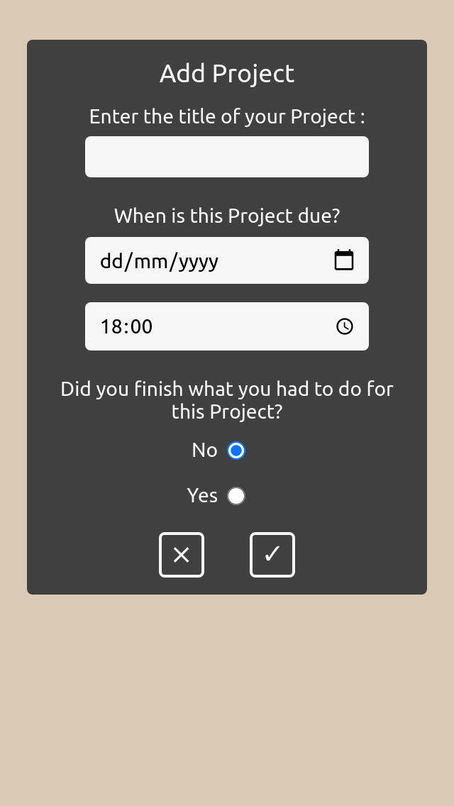

<div id="top"></div>
<h1 align="center">organize.it</h1>

  <p align="center">
    Timing is everything.
    <br />
    <br />
    <a href="https://organize-67e5f.web.app/">View Demo</a>
    ·
    <a href="https://github.com/leau-void/todo-app/issues">Report Bug</a>
    ·
    <a href="https://github.com/leau-void/todo-app">Request Feature</a>
  </p>
</div>

## About The Project

[](https://organize-67e5f.web.app/)

<a href="#preview">More screenshots</a>

organize.it is a to-do list app, that let users them create projects, to-dos, and checklists. It saves all data to Firebase and so the users can recover them from session to session.

## Getting started

```
git clone https://github.com/leau-void/todo-app.git
cd todo-app
npm install
firebase serve --only hosting
npx webpack --watch

```

## Built With

- Vanilla JS
- Vanilla CSS
- [Webpack](https://webpack.js.org/guides/)
- [AirBnb Style Guide](https://github.com/airbnb/javascript)
- [Cloud Firestore](https://firebase.google.com/docs/firestore)
- [Firebase Auth](https://firebase.google.com/docs/auth)
- [OOP Principles](https://en.wikipedia.org/wiki/Object-oriented_programming)

## Preview

### Desktop
<div align="center">
<a href="https://organize-67e5f.web.app/"></a>
<a href="https://organize-67e5f.web.app/"></a>
<a href="https://organize-67e5f.web.app/"></a>
</div>

### Mobile 
<div align="center">
<a href="https://organize-67e5f.web.app/"></a>
<a href="https://organize-67e5f.web.app/"></a>
<a href="https://organize-67e5f.web.app/"></a>
</div>

## Contact

Leau P - [LinkedIn](https://www.linkedin.com/in/leau-p) - lpierra@gmail.com

Project Link: [https://github.com/leau-void/todo-app](https://github.com/leau-void/todo-app)

<p align="right">(<a href="#top">back to top</a>)</p>

